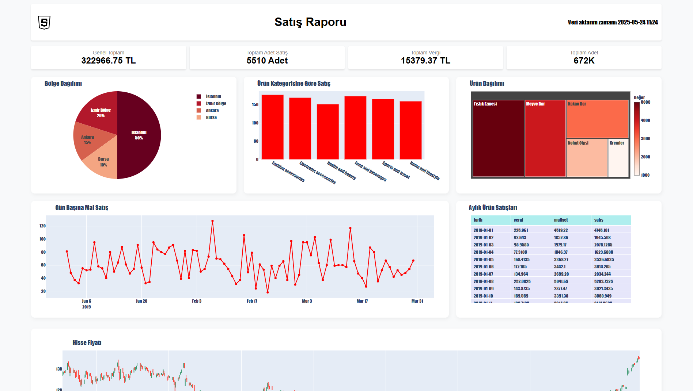
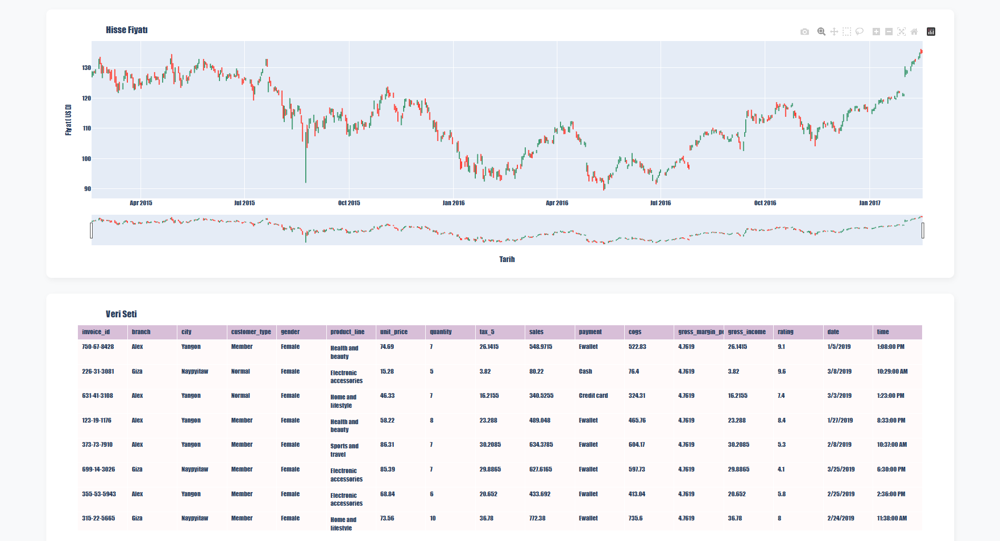

# 📊 İş Zekâsı Veri Panosu

PostgreSQL ve Plotly kullanarak iş verilerini analiz etmek ve görselleştirmek için geliştirilen __etkileşimli__ bir Flask tabanlı pano. Satış, ürün kategorileri, ödemeler ve eğilimler hakkında içgörüler edinmek isteyen __şirketler__ için idealdir.

## Özel Panolar & Makine Öğrenimi Hizmetleri

Verilerinden içgörüler elde etmek isteyen __şirketler__ ve __bireyler__ için özelleştirilmiş pano çözümleri sunuyorum.

Satış, operasyonlar veya müşteri davranışları gibi konularda __görsel analizler__ arıyorsanız, iş ihtiyaçlarınıza özel panolar geliştirebilirim.

Ayrıca, verilerinize __makine öğrenimi__ teknikleri uygulayarak __tahminleme__, __sınıflandırma__, __kümeleme__ gibi analizlerle daha derin ve uygulanabilir içgörüler elde etmenize yardımcı olabilirim.

📬 Şirketiniz için özel bir veri çözümü oluşturmak isterseniz, benimle iletişime geçmekten çekinmeyin.

---

## 🛠️ Kullanılan Teknolojiler

- **Flask** – Web sunucusu ve şablonlama
- **SQLAlchemy** – PostgreSQL için ORM
- **Plotly** – Etkileşimli grafikler (çizgi, ağaç haritası, pasta, mum grafiği)
- **Pandas** – Veri işleme
- **PostgreSQL** – İlişkisel veritabanı

-------------------------------------------------------------------------

# 📊 Business Intelligence Data Dashboard

A Flask-based __interactive__ dashboard to analyze and visualize business data using PostgreSQL and Plotly. Ideal for __companies__ seeking insights into their sales, product lines, payments, and trends.

---

## 💼 Custom Dashboards & ML Services

I offer __customized dashboard solutions__ for companies and individuals who want to gain insights from their data.

Whether you're looking for a visual representation of sales, operations, or customer behavior, I can develop tailored dashboards to meet your business needs.

Additionally, I can apply __machine learning techniques__ to your data for __forecasting__, __classification__, __clustering__, or other predictive analytics tasks — helping you extract deeper, actionable insights.

📬 Feel free to reach out if you're interested in building a custom data solution for your organization.

---

## 🛠️ Technologies

- **Flask** – Web server and templating
- **SQLAlchemy** – ORM for PostgreSQL
- **Plotly** – Interactive graphs (line, treemap, pie, candlestick)
- **Pandas** – Data wrangling
- **PostgreSQL** – Relational database
